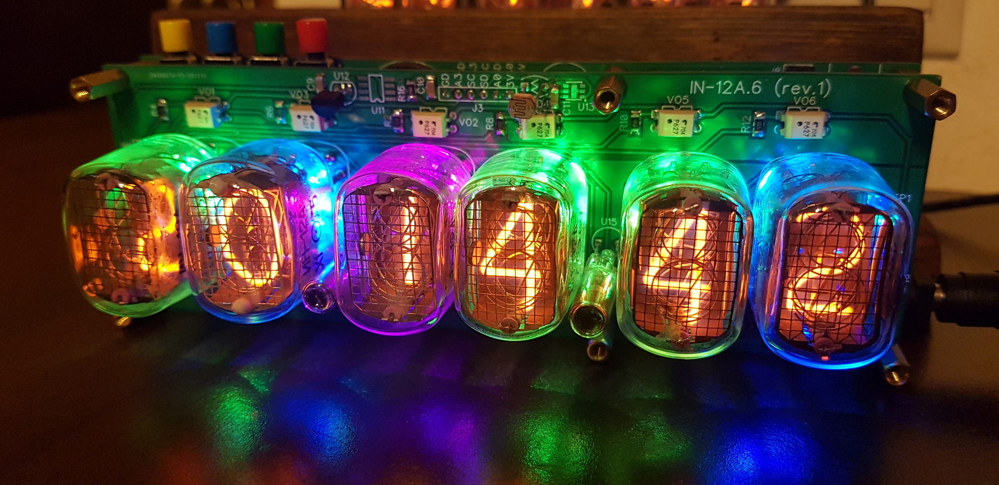

# nixie_clock

## How to get project

> git submodule update --init --recursive
> git clone --recursive

## Recommended ESP32 IDF version

v4.0.1

> git clone -b v4.0.1 --recursive https://github.com/espressif/esp-idf.git esp-idf-v4.0.1 

## How to configure nixie-clock

If nixie clocks device is not yet configured, after power up it runs AP wi-fi mode
(ssid: "NixieClockXXXXXX", where XXXXXX is MAC address of the device; and password: "00000000").
In case if nixie clocks device is already configured, you can always reconfigure device
by pressing and holding Button 4 (_on some devices this button is located on main board in the
left-front corner_).

Connect to AP provided by Nixie Clock from Mobile Phone or PC, and then open web-page
https://nixie-clock.local/ in browser. If your device (PC or Mobile Phone) doesn't support
zeroconf, then use https://192.168.4.1/ url.

If nixie clocks are configured to connect your Home AP, then connect to your Home AP from
Mobile Phone or PC, and then open web-page https://nixie-clock.local/ (or https://ip/) in browser.

Remember, IGMP Snooping must be enabled to allow zeroconf protocol.

## Integrating with Home Assisant

NixieClocks support digest authentication over https. So, they can be esaily integrated to
[Home Assistant](https://www.home-assistant.io/integrations/rest). For example, here is the curl
example on how to get current temperature from the NixieClock device:

> curl --digest --user admin:password -d "name=temp" -k -X POST https://192.168.1.68/param

You can make NixieClocks to play desired melody (number 5):

> curl --digest --user admin:password -d "name=temp&value=5" -k -X POST https://192.168.1.68/param

## Manual on Keys

There are 2 types of Nixie Clocks available:

**Revision 1**
The device has 4 hardware buttons: 3 buttons on the top (or back) side, and 1 button (Button 4) on
Main board (left side).

**Revision 2**
The device has 6 hardware buttons: 4 buttons on the top (or back) side, and 2 buttons on Main board.
Buttons on Main board are: left is reboot button, and middle-button is factory reset button.

### Buttons on Main board

 * Left-front button on Main board is reset button. If clock hangs up, reset button short press will
reboot clocks. The same can be done via power cut.
 * Middle (second) button on Main board is Factory reset button. Hold it during power cycle to reset
clock to factory settings and firmware

### Buttons on back side

#### Normal clock operating mode

 * Button 1
   * Short press - change display mode (time, temperature)
   * Long press - enter clock setup mode
 * Button 2
   * Short press - change highlight color
   * Long press - setup alarm
 * Button 3
   * Short press - disable/enable highlight
   * Long press - turn off/turn on clock (sleep mode)
 * Button 4
   * Short press - display IP address
   * Long press - start AP mode for setup

#### Temperature mode

 * Timeout - return to Normal clock operating mode

#### Display IP address mode

 * Any button - return to Normal clock operating mode
 * Timeout - return to Normal clock operating mode

#### Sleep mode

 * Button 1
   * Short press - wake up to Normal clock operating mode
 * Button 2
   * Short press - wake up to Normal clock operating mode
 * Button 3
   * Short press - wake up to Normal clock operating mode
 * Button 4
   * Short press - wake up to Normal clock operating mode

#### clock setup mode

 * Button 1
   * Short press - switch between hours, minutes, seconds, year, month, day
   * Long press - save setup
 * Button 2
   * Short press - increase value
 * Button 3
   * Short press - decrease value
 * Button 4
 * Timeout - return to normal operating mode without clock change

### RGB leds

Nixie Clock allows to control RGB leds color using Button 2 and Button 3, and
you can control RGB color from web GUI.
In some special cases RGB leds are used to indicate different clock states:

| **Color** | **Comment** |
| :-------- |:---------|
| User defined color | Normal operating mode |
| Blinking blue | Upgrade is in progress |
| Blinking green | Upgrade is successful, Nixie Clock will be rebooted |
| Blinking red | Upgrade failed |
| Green with 2 blue leds | Disconnected from AP |
| Green with 2 yellow leds | Running in AP mode with connected client |
